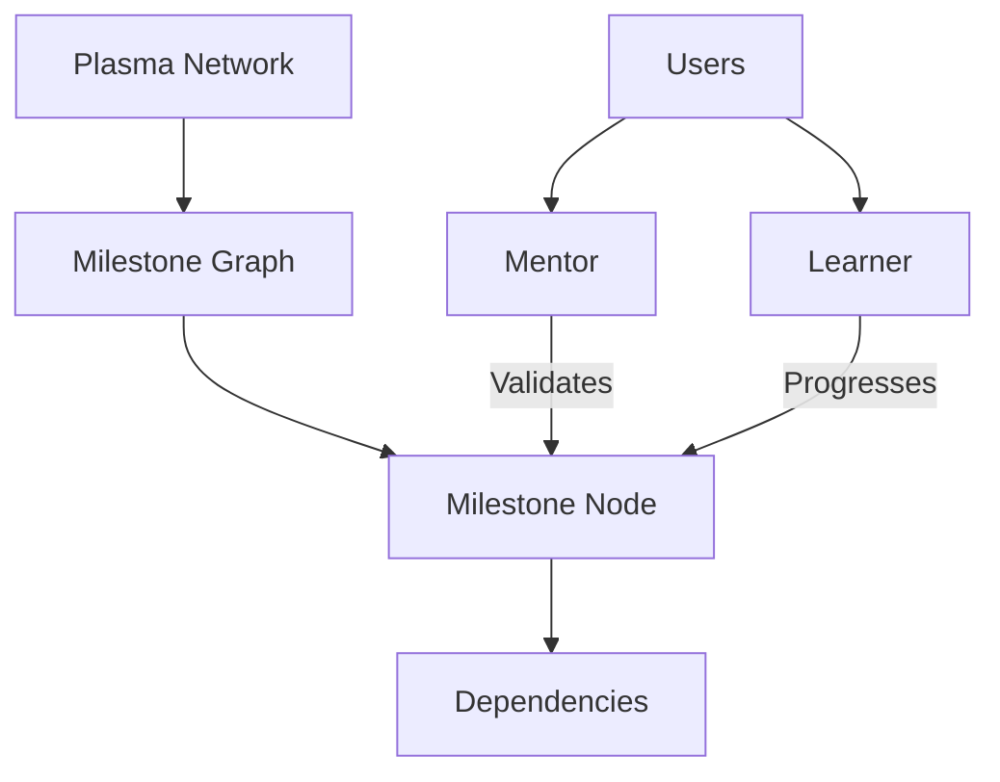

# Bulletproof Plasma Package

A decentralized learning progression system powered by blockchain technology, leveraging plasma-inspired architecture for secure, transparent achievement tracking.

## Overview

The Bulletproof Plasma Package is an innovative blockchain-based learning tracker that creates immutable, verifiable records of educational and skill development journeys. By utilizing a plasma network-inspired design, this system provides a robust, secure mechanism for tracking, validating, and visualizing learning milestones.

### Key Features

- Decentralized milestone tracking
- Plasma network-inspired architecture
- Secure, immutable achievement records
- Multi-role collaboration framework
- Complex learning path representations
- Transparent verification mechanisms

## Architecture

The system represents learning progression as an interconnected graph of milestones, where each milestone can have dependencies, complexity levels, and verification requirements.



### Core Components

- **Users**: Four distinct roles (Admin, Plasma Researcher, Mentor, Learner)
- **Plasma Networks**: Collections of interconnected milestone graphs
- **Milestones**: Individual learning or skill achievement nodes
- **Connections**: Mentor-learner and researcher-learner relationships
- **Progressions**: Verified achievement and skill development records

## Contract Documentation

### plasma-milestone-tracker.clar

The core contract managing the Bulletproof Plasma Package's functionality.

#### Key Maps
- `users`: Stores user information and roles
- `plasma-networks`: Defines milestone graph collections
- `milestones`: Tracks learning and skill achievement definitions
- `milestone-progressions`: Records verified achievement progress
- `user-connections`: Manages authorized relationships

## Getting Started

### Prerequisites
- Clarinet
- Stacks blockchain wallet
- Clarity smart contract development environment

### Basic Usage

1. Register a user:
```clarity
(contract-call? .plasma-milestone-tracker register-user "Alice Johnson" u2)
```

2. Create a plasma network:
```clarity
(contract-call? .plasma-milestone-tracker create-plasma-network "Machine Learning" "Advanced ML skills progression")
```

3. Create a milestone:
```clarity
(contract-call? .plasma-milestone-tracker create-milestone 
    "Neural Network Basics" 
    "Understand fundamental neural network concepts" 
    "Machine Learning" 
    u2 
    u1 
    none)
```

## Development

### Testing
1. Clone the repository
2. Install Clarinet
3. Run `clarinet test`
4. Use `clarinet console` for interactive testing

### Local Development
1. Set up local Clarinet chain
2. Deploy contracts using `clarinet deploy`
3. Interact through console or API

## Security Considerations

### Plasma Network Security
- Immutable milestone records
- Role-based access controls
- Transparent verification process
- Decentralized progression tracking

### Best Practices
- Verify user connections before granting access
- Provide comprehensive evidence for milestone progression
- Follow dependency patterns for structured learning
- Regularly audit progression records

## License

[Include your project's license here]

## Contributors

[List contributors or contribution guidelines]